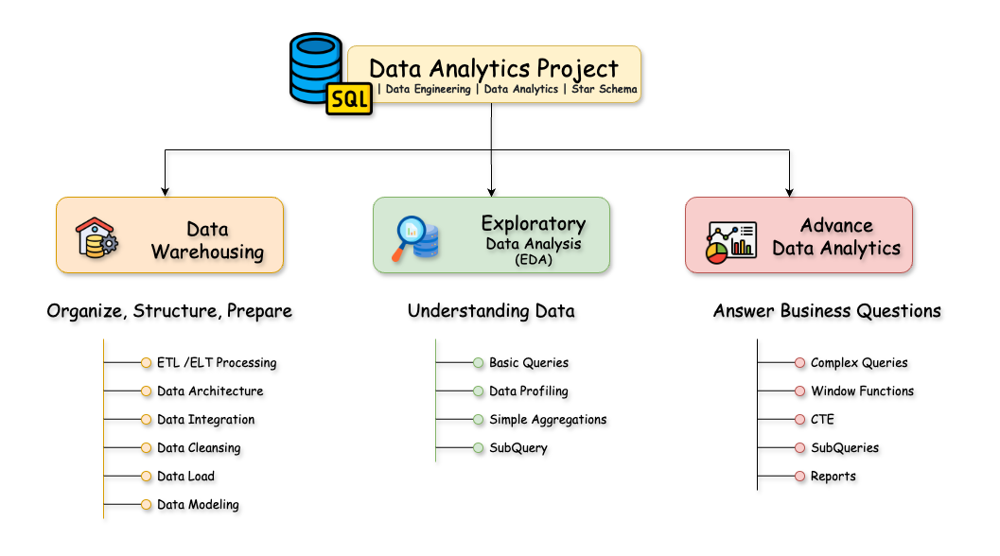
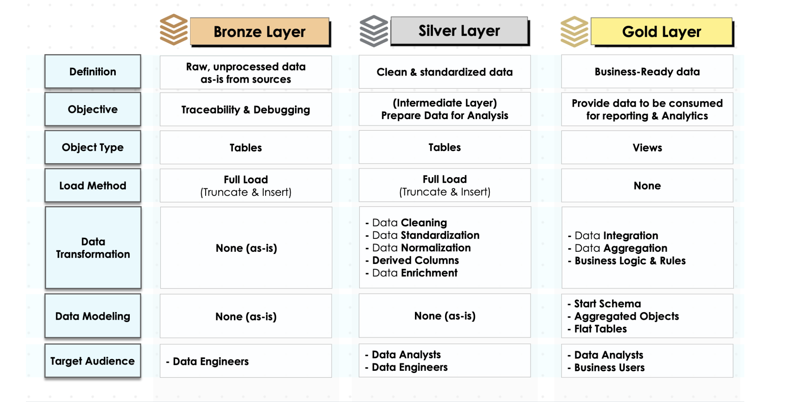
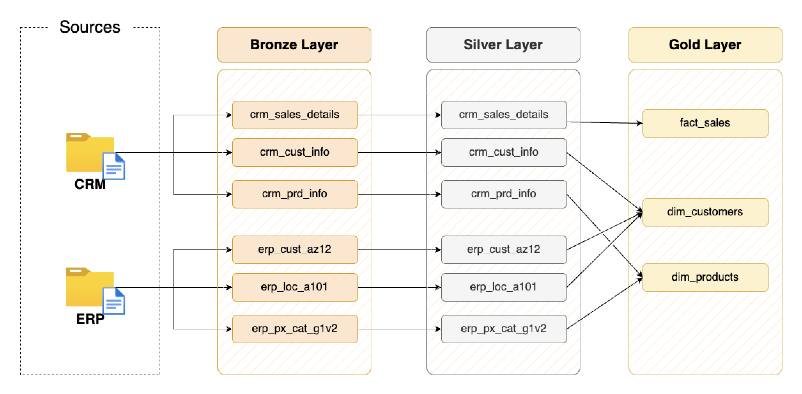
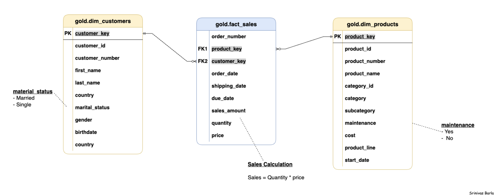
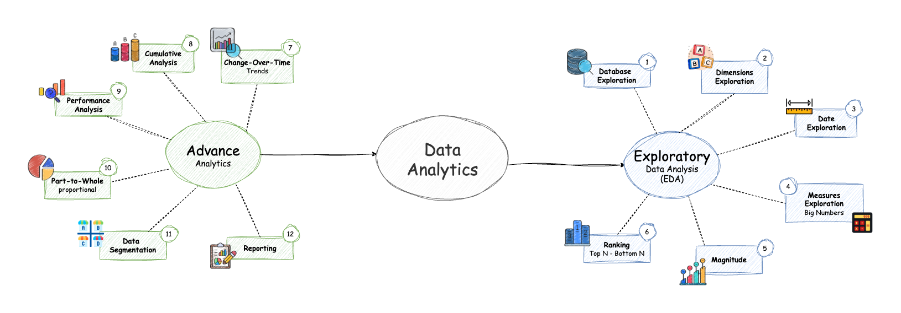

# From Warehousing to Insights

Welcome to the comprehensive **Data Analytics End-to-End Project** repository! 🚀

**SQL | Data Engineering | Data Analytics | Star Schema**

This project demonstrates a complete data analytics lifecycle, progressing from data warehousing fundamentals through exploratory data analysis to advanced analytics. Designed as a professional portfolio project, it showcases industry best practices in data engineering and analytics, providing actionable business intelligence through SQL.

---

## 📖 Project Overview

This end-to-end analytics project consists of three major components:

### 1. Data Warehousing
- **Data Architecture**: Implementation of a Modern Data Warehouse using Medallion Architecture with Bronze, Silver, and Gold layers.
- **ETL Pipelines**: Extraction, transformation, and loading of data from source systems.
- **Data Modeling**: Development of fact and dimension tables in a star schema optimized for analytical queries.

### 2. Exploratory Data Analysis (EDA)
- **Database Exploration**: Examining database structure, tables, and schemas.
- **Dimensions Exploration**: Analyzing categorical data and relationships.
- **Date Range Analysis**: Understanding temporal boundaries and historical data span.
- **Measures Exploration**: Calculating key metrics and aggregated values.
- **Magnitude Analysis**: Quantifying data distribution across dimensions.
- **Ranking Analysis**: Identifying top and bottom performers across various metrics.

### 3. Advanced Analytics
- **Change-Over-Time Analysis**: Tracking trends, growth patterns, and temporal shifts in metrics.
- **Cumulative Analysis**: Calculating running totals and moving averages for long-term trend identification.
- **Performance Analysis**: Measuring year-over-year and month-over-month performance changes.
- **Data Segmentation**: Categorizing data into meaningful groups for targeted insights.
- **Part-to-Whole Analysis**: Calculating proportional contributions to identify key influencers.
- **Comprehensive Reporting**: Generating detailed customer and product performance reports.

---
- **[Notion Project Step](https://www.notion.so/SQL-Data-Warehouse-Project-1b252229f9a180e3b2c2f7ca7c380720?pvs=4):** Access to All Project Phases and Tasks.
---
## Phase 1. 🏗️ Data Warehousing

The data warehousing phase implements a robust foundation for analytics by establishing a modern, scalable architecture that ensures data quality, accessibility, and analytical utility.

### **A. Architecture Design**

The project follows the **Medallion Architecture**, which includes three distinct layers:

| Layer         | Definition                   | Objective                                | Transformation                                   | Target Audience       |
|---------------|------------------------------|------------------------------------------|-------------------------------------------------|-----------------------|
| Bronze Layer  | Raw, unprocessed data        | Traceability & Debugging                | None                                           | Data Engineers        |
| Silver Layer  | Cleaned & standardized data  | Prepare data for analysis               | Data cleaning, standardization, normalization   | Data Analysts & Engineers |
| Gold Layer    | Business-ready data          | Reporting & Analytics                   | Data integration, aggregation, business logic   | Business Users & Analysts |


### **B. ETL Implementation**

The ETL process was designed to efficiently move and transform data across the Medallion layers:

#### Bronze Layer
- **Objective**: Ingest raw data from ERP and CRM systems as-is into SQL tables.
- **Load Method**: Full load using `Truncate & Insert`.
- **Data Sources**: CSV files containing sales transactions, customer information, and product details.
- **Key Features**:
  - Maintained complete traceability for debugging purposes.
  - Ensured no transformations were applied at this stage.

#### Silver Layer
- **Objective**: Cleanse and standardize raw data for analytical use.
- **Transformations**:
  - Handled missing values and NULLs.
  - Standardized date formats across systems.
  - Normalized categorical values (e.g., country names).
  - Derived additional columns such as `customer_age` and `order_month`.
- **Load Method**: Full load using `Truncate & Insert`.

#### Gold Layer
- **Objective**: Provide business-ready data modeled in a star schema optimized for reporting.
- **Transformations**:
  - Integrated ERP and CRM datasets into unified fact and dimension tables.
  - Applied business rules to calculate KPIs such as total sales and customer lifetime value.
  - Aggregated transactional data into summary views for efficient querying.

### **C. Data Modeling**

The Gold Layer employs a star schema design:

- **Fact Table**:
  - `fact_sales`: Contains transactional sales data with measures such as `sales_amount` and `quantity`.
- **Dimension Tables**:
  - `dim_customers`: Holds customer demographic details.
  - `dim_products`: Contains product categories, subcategories, and pricing details.

---

## Phase 2: 🔍 Exploratory Data Analysis (EDA)

The EDA phase involved systematic exploration of the dataset to uncover patterns, anomalies, and relationships. Key steps included:

### **Database Exploration**
- Inspected database schemas using `INFORMATION_SCHEMA` queries.
- Documented table structures, column metadata, and constraints.

### **Dimensions Exploration**
- Analyzed unique categories in dimensions such as `country`, `category`, and `subcategory`.
- Explored hierarchical relationships between products.

### **Date Exploration**
- Identified temporal boundaries of the dataset (first and last order dates).
- Calculated customer age distribution based on birthdates.

### **Measures Exploration**
- Computed key metrics such as total sales, average order value, and total customers.
- Generated summary reports of business performance indicators.

### **Magnitude Analysis**
- Quantified distributions across dimensions (e.g., revenue by category).
- Analyzed geographic sales performance.

### **Ranking Analysis**
- Identified top-performing products, customers, and regions using window functions (`RANK`, `DENSE_RANK`).

---
  
  
---

## Phase 3: 📊 Advanced Analytics

The advanced analytics phase transformed raw data into actionable insights through sophisticated SQL implementations. Key analyses included:

### **Change Over Time Analysis**
Tracked trends in key metrics over time:
- Year-over-year (YoY) growth in total sales.
- Monthly revenue trends using date functions (`DATETRUNC`, `FORMAT`).

### **Cumulative Analysis**
Calculated running totals to track cumulative performance:
- Running total of sales over time using window functions (`SUM() OVER()`).
- Moving averages for trend smoothing.

### **Performance Analysis**
Benchmarked performance across periods:
- Compared current sales to previous year’s performance using `LAG()`.
- Identified trends (increasing/decreasing/stable) with conditional logic (`CASE`).

### **Data Segmentation**
Segmented entities into meaningful groups:
- Customer segmentation based on spending behavior (`VIP`, `Regular`, `New`).
- Product categorization by price range (`High Performer`, `Mid Range`, `Low Performer`).

### **Part-to-Whole Analysis**
Analyzed proportional contributions:
- Category-wise share of total revenue.
- Pareto analysis to identify top contributors (80/20 rule).

---

## 🛠️ Technologies Used

This project utilizes the following free tools and technologies:

1. **SQL Server Express**: Database engine for implementing the warehouse.
2. **SQL Server Management Studio (SSMS)**: GUI for managing databases.
3. **DrawIO**: Tool for creating architecture diagrams.
4. **Notion**: For project management documentation.

---

## 📂 Repository Structure

```
data_analytics_project/
│
├── datasets/ # Raw datasets used for the project
│
├── docs/ # Documentation files
│ ├── images/ # Visual diagrams
│ │ ├── Overview.jpg # Project overview diagram
│ │ ├── EDA_-_Advanced.jpg # EDA + Advanced Analytics diagram
│ │ └── data_flow_map.jpg # Data flow map
│ │
│ └── data_catalog.md # Data Definitions
│
├── scripts/ # SQL scripts for each phase
│ ├── bronze/ # Scripts for loading raw data
│ ├── silver/ # Scripts for cleaning/standardizing data
│ ├── gold/ # Scripts for creating analytical models
│ ├── init_database.sql # Scripts for creating initial database
│ └── data_analysis/ # EDA & Advanced analytics scripts
│
├── tests/ # SQL  test scripts
│ ├── quality_checks_gold.sql # Test scripts for gold Layer
│ ├── quality_checks_silver.sql # Test scripts for silver Layer
│
├── README.md # Project overview (this file)
├── requirements.txt
└── LICENSE # License information

```
---
## 🛠️ Important Tools & Links used for this project:

Everything is for Free!
- **[Datasets](datasets/):** Access to the project dataset (csv files).
- **[SQL Server Express](https://www.microsoft.com/en-us/sql-server/sql-server-downloads):** Lightweight server for hosting your SQL database.
- **[SQL Server Management Studio (SSMS)](https://learn.microsoft.com/en-us/sql/ssms/download-sql-server-management-studio-ssms?view=sql-server-ver16):** GUI for managing and interacting with databases.
- **[Git Repository](https://github.com/):** Set up a GitHub account and repository to manage, version, and collaborate on your code efficiently.
- **[DrawIO](https://www.drawio.com/):** Design data architecture, models, flows, and diagrams.
- **[Notion](https://www.notion.com/):** All-in-one tool for project management and organization.
---
## 🛡️ License

This project is licensed under the [MIT License](LICENSE). You are free to use, modify, and share this project with proper attribution.

## 🌟 About Me

Hi there! I'm **Srinivas Barla**, also known as Srini! I'm an IT professional passionate about sharing knowledge and making working with data enjoyable!

Let's stay in touch! Feel free to connect with me on the following platforms:

[](https://www.linkedin.com/in/srinivas-barla/)
[](https://barlasrinivas.github.io/)
